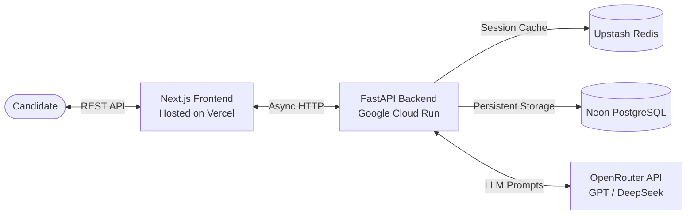

<div align="center">


<br/>

# 🎙️ AI Interview Coach
**Elevate your career with AI-driven interview simulations.**

[](https://nextjs.org/)
[](https://fastapi.tiangolo.com/)
[](https://www.postgresql.org/)
[](https://redis.io/)
[](https://www.docker.com/)

[**Live Application**](https://app-interview-xi.vercel.app/) • [**Backend API (Swagger)**](https://interview-backend-737275753890.asia-southeast1.run.app/docs) • [**Report a Bug**](https://github.com/Arfiadi/app-interview/issues)

</div>

---

## 🌟 Executive Summary

**AI Interview Coach** is a state-of-the-art practice platform designed to simulate high-stakes professional interviews. By leveraging advanced Large Language Models (LLMs) via OpenRouter, it provides dynamic, role-specific questions and instantaneous, human-like qualitative feedback—empowering candidates to land their dream jobs.

---

## ✨ Premium Features

| Feature | Description |
| :--- | :--- |
| 🎯 **Dynamic Tailoring** | Auto-generates nuanced questions based on your specific **Job Role**, **Industry**, and **Experience Level**. |
| 🧠 **Semantic NLP Scoring** | Answers are evaluated for conceptual accuracy (0-100) using AI, moving beyond simple keyword matching. |
| 💡 **STAR-Method Coaching** | Receive actionable, structured feedback. The AI rewrites your answers into compelling, professional narratives. |
| 📊 **Advanced Analytics** | Visualize your growth through an interactive dashboard mapping your score trends and career focus areas. |
| 🖨️ **Exportable Portfolios** | Generate clean, print-ready PDF reports of your interview performance for personal archiving or mentoring. |

---

## 🏗️ System Architecture

Our platform utilizes a highly scalable, asynchronous microservices architecture to ensure real-time AI processing without latency bottlenecks.



---

## 🚀 Live Deployment

Experience the application in production:

- **Web Interface:** [app-interview-xi.vercel.app](https://app-interview-xi.vercel.app/)
- **Core Backend:** [interview-backend-737275753890.asia-southeast1.run.app](https://interview-backend-737275753890.asia-southeast1.run.app)

---

## 💻 Developer Setup

Get the environment up and running on your local machine in under 2 minutes.

### 1. Prerequisites
- [Docker Desktop](https://www.docker.com/products/docker-desktop/)
- An [OpenRouter API key](https://openrouter.ai/)

### 2. Environment Variables
Create a `.env` file in the project root to securely inject your configurations:

```env
OPENROUTER_API_KEY=your_openrouter_api_key_here
LLM_MODEL=openai/gpt-4o-mini        # AI Model of your choice
SECRET_KEY=change_this_to_a_strong_secret_key
```

### 3. Ignition (Via Docker)

Boot up the entire stack—Frontend, Backend, Database, and Cache—with a single command:

**Windows:**
```batch
run_app.bat
```

**Linux / macOS:**
```bash
docker-compose up --build -d
```

> **Access Points:**
> - Frontend: `http://localhost:3005`
> - Backend Swagger UI: `http://localhost:8000/docs`

---

## 🧪 Quality Assurance

We maintain strict reliability standards through comprehensive automated testing. The backend is validated using an in-memory asynchronous SQLite database.

```bash
cd backend
pytest -c pytest.ini
```

---

<div align="center">
  <p>Architected and Developed by <strong>Arfiadi</strong></p>
  <a href="https://github.com/Arfiadi">
    
  </a>
</div>